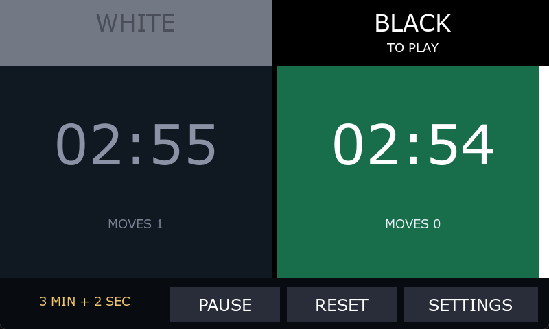
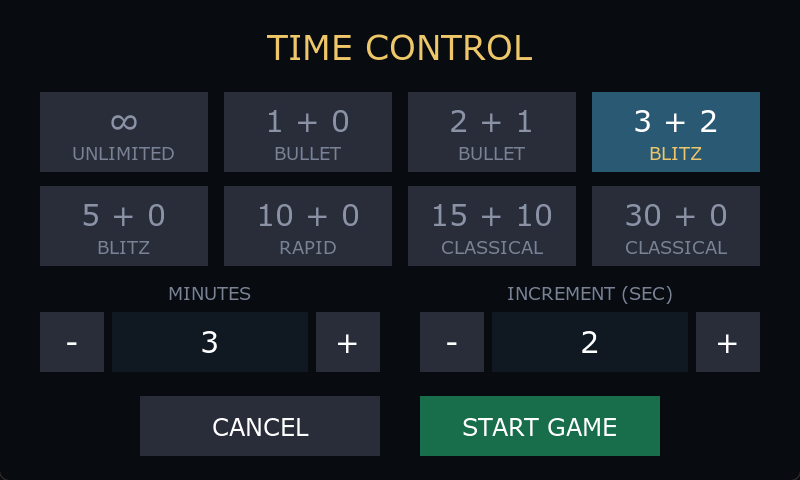

# Chess Clock

A two-player chess clock for the STM32F769I-DISCO, built with TouchGFX 4.26.1.



Each half of the 800x480 display is one player's button. Tapping your own half ends
your move and starts the opponent's clock, the way the button on a physical clock
works. Tapping the other player's half does nothing.

## Playing

- **Start** — tap either half, or the START button. White always moves first.
- **Hand over** — tap your own half.
- **Pause / resume** — the middle button. Opening SETTINGS pauses first, so nobody
  loses time on a menu.
- **Reset** — rearms both clocks with the current time control.

Whose turn it is is signalled without words. Each half is headed by a name plate in
the piece colour it stands for, dark on white or white on black. The half on the
clock fills with colour, a bar lights up along its outer edge, and the waiting
player's plate fades back.

A timed clock turns amber under 30 seconds, blinks red under 10, and switches to
tenths of a second under 20. When a flag falls the clock stops and the plates read
FLAG FELL and WINS.

## Time controls



Eight presets plus a pair of steppers. The steppers take coarser jumps at the top
end, so 90 minutes is not 89 taps away.

The default is **unlimited**: the clocks count up from zero and no flag can fall,
which is what you want for a clock that sits on a table and gets used sporadically.
Zero minutes is how the model represents this, so it falls out of the ordinary time
control rather than being a second mode. Timed controls add a Fischer increment once
a move is completed.

Settings are not persisted — a power cycle comes back up unlimited.

## Building

TouchGFX Designer opens `TouchGFX/ChessClock.touchgfx`. From a shell:

```
tgfx compile --path=<abs path>\TouchGFX\ChessClock.touchgfx --simulator -g
TouchGFX\build\bin\simulator.exe
```

Swap `--simulator` for `--target` to build for the board. Flashing needs
STM32CubeProgrammer. To change IDE, open `STM32F769I_DISCO.ioc` in STM32CubeMX and
pick from EWARM, MDK-ARM or STM32CubeIDE.

Generated code, build output and the TouchGFX framework itself are not in the repo;
`tgfx generate` recreates them.

## Layout

The Designer project owns the static layout of both screens. Behaviour lives in
hand-written code the Designer never overwrites:

| Path | |
|---|---|
| `TouchGFX/gui/model/` | the clock: state machine, countdown, increment, flag |
| `TouchGFX/gui/gamescreen_screen/` | clock face |
| `TouchGFX/gui/settingsscreen_screen/` | time control picker |
| `TouchGFX/gui/common/ClockTime.*` | millisecond time base |
| `TouchGFX/assets/texts/texts.xml` | typographies and text |

Two things worth knowing before changing them:

**The clock does not count display frames.** The TouchGFX tick follows the panel
refresh, which is only roughly 60 Hz, and the drift would be visible over a long
game. `ClockTime` reads `HAL_GetTick()` on the target and a steady clock in the
simulator. It declares `HAL_GetTick` itself rather than including the CubeMX
headers, so the TouchGFX sources keep their own include path.

**Buttons are Boxes with hit testing**, not `touchgfx::Button` widgets, which need
bitmaps. The project ships no image assets as a result, and the two large tap
targets and the small ones share one code path in `handleClickEvent`.

## Board notes

Configured for 480x800 at 16bpp, rotated to landscape. Video decoding orientation is
set to Rotated in STM32CubeMX X-CUBE-TOUCHGFX to match; switch it to Native if you
ever use the display in portrait.

Performance pins: `VSYNC_FREQ` PC6, `RENDER_TIME` PC7, `FRAME_RATE` PJ1,
`MCU_ACTIVE` PF6.

## Enclosure

`enclosure/` holds printable STLs for a three-part case around the DISCO board:
`base.stl`, `hood.stl` and `stand_10deg.stl`, a 10-degree desk stand. The hood
telescopes over the base and is held by four M3x8 screws through vertical slots,
giving 32 to 44 mm of total height; the stand takes two M3x10 with nuts. The board
keeps its original white feet and rests on four pads inside the base.

Print in PLA or PETG, 0.2 mm layers, 3-4 walls, 15-20% infill. `base.stl` goes
floor down, `hood.stl` is already exported roof down — do not flip it — and
`stand_10deg.stl` sits on its flat underside. The hood needs local supports at the
screw slots and the tops of the connector cutouts.

The fit has not been verified on hardware, and the display opening is an estimate.
Check that the hood presses on neither glass nor board before tightening anything.
